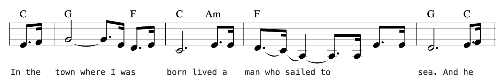

# MySheetMusic

This one-page web app manages a collection of song files, which are plain text files in a
[custom format](#file-format). The format was designed to capture a single voice
of a musical score, with melody, text and harmony (i.e. chords) - basically
**[lead sheets](https://en.wikipedia.org/wiki/Lead_sheet)**.

## Frontend

The [index.html](index.html) page renders a single song file, using [VexFlow](https://www.vexflow.com/). The UI is very simplistic, but designed to work well on all screen sizes.
The idea is to open the page on some mobile device to play along.

Switching between songs is quick and easy, with an alphabetically sorted song list.
Both notes and lyrics can be edited in-line for quick adjustments (don't forget to save).

The [editor.html](editor.html) page allows adding new songs or editing existing
ones. Songs can be typed in manually or imported from MusicXML files. There are
basic controls to shift the full song by whole steps or octaves. Right now,
this page is not very user friendly, and of course requires some familiarity with
the [file format](#file-format) described below.

## Backend

[songs.php](songs.php) is a small PHP script that allows the frontend
to create and modify text files on the server. This is a very simple solution
for setups with an existing web server (Apache2, nginx, etc.). This could be
replaced by some JavaScript code that stores the song files in a Google Drive
folder or similar. I am considering to add such a feature in the future to allow
serverless setups.

## File Format

The core idea behind this web app is an extremely lightweight file format
that is both human and machine readable. It has three tracks, to indicate to
a single pianist what to do with his/her left and right hand, and optionally
what to sing along.

Here is an example for the start of "Yellow Submarine" by the Beatles:

```
3o.1 4x
In the

5h5 ~5o. 3x 2o.4 3x
town where I was

1h.1 3o.6m 3x
born lived a

2o.4 ~1x ~6,q ~6,o. 6,x 3o. 3x
man who sailed to

2h.5 3o.1 4x
sea. And he

...
```



- Each row represents a bar, separated by empty lines
- A bar consists of a note line and one or more lyrics lines
- The notes in the notes line are separated by spaces
- Each note indicates (in order):
  - Pitch
  - Octave (optional)
  - Duration
  - Chord (optional)
- The pitch is notated as degree relativ to the tonic of the (major) scale
  - In C major: `1`=C, `2`=D, `3`=E, `4`=F, `5`=G, `6`=A, `7`=B
- The pitch can be modified by a `#` or a `b` (e.g. `4#`)
- Pauses are notated as pitch `0`
- The octave is notated as shift from "middle" (e.g. middle C)
  - each `,` after the pitch shifts the note one octave down
  - each `'` after the pitch shifts the note one octave down
- The duration uses predefined symbols:
  - `w` = whole
  - `h` = half
  - `q` = quarter
  - `o` = 8th
  - `x` = 16th
  - `z` = 32th
- The duration symbol might be followed by a `.` to indicated dotted notes
- The chord is indicated by its base note (as common), but as scale degree
- The chord degree can be followed by an arbitrary string, e.g. "m" or "sus4"
  - In C major: `1`=C, `6m`=Am, `5sus`=Gsus

This notation could be mapped to any scale, but the frontend will always
render songs in C major (for now).

There are two special notations:

A `~` before a note (that is, in front of the pitch degree) indicates that the
note is **tied** to the previous one. This also works for the first note of the bar
(even though the VexFlow rendering is not optimal).

A `t` at the very end of a note indicates that this note is part of a **tuplet**.
The consecutive number of notes with a `t` decide the size of the tuplet, i.e.
three `t` notes form a triplet. In the rare case of two directly adjacent tuplets,
a `|` character can be used to mark the break:

```
1ot 1ot 1ot | 2ot 2ot 2ot
```

The file format was inspired by VexFlow's [EasyScore](https://github.com/0xfe/vexflow/wiki/Using-EasyScore), but it is - in my opinion - even easier!
