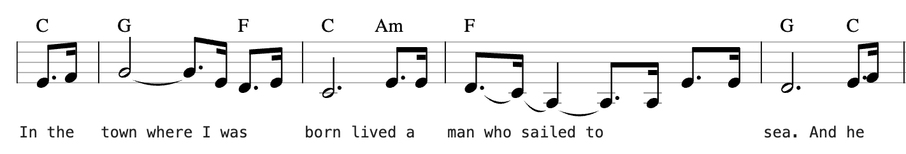

# MySheetMusic

A web app that manages a personal collection of sheet music, stored as plain
text files in a [custom format](#file-format). The format is designed to capture
a single voice of a musical score, with melody, text and harmony -
think **[lead sheets](https://en.wikipedia.org/wiki/Lead_sheet)**.

## Interface

The [index.php](index.php) page shows a list of all songs, with one column per
group. It also allows to add new songs.

The [song.php](song.php) renders the score for a single song. The UI is very
minimal and should work well on any screen size (e.g. to view sheet music on a
tablet on a music stand or piano).

Via the editor, it is possible to directly edit a song (see [file format](#file-format)),
or to import a voice from a [MusicXML](https://en.wikipedia.org/wiki/MusicXML) file.

When saving a song, the [VexFlow](https://www.vexflow.com/) library is used to
pre-render sheet music based on the plain text notation. The generated HTML
is stored for quick, JavaScript free loading / viewing on any device.

The song page also allows playing the song via a very basic synthsizer,
but this feature is still very limited and not designed to generate a
musical rendition, but more as a quick check if the notated melody is correct.

## File Format

The central idea behind this web app is an extremely simple text format to store
the core information of a musical piece in a format that is both human- and
machine readable. A song is represented as a list of measures, each of which
with a "music" line for the melody (and chords) and any number of lyrics lines.

Here is an example for the start of "Yellow Submarine" by the Beatles:

```
3o.1 4x
In the

5h5 ~5o. 3x 2o.4 3x
town where I was

1h.1 3o.6m 3x
born lived a

2o.4 ~1x ~6,q ~6,o. 6,x 3o. 3x
man who sailed to

2h.5 3o.1 4x
sea. And he

...
```

Notes and chords are notated as scale degrees (1-7). For rendering, the
degrees are translated into the C major scale:



### Specification

- Each row represents a measure, separated by empty lines
- A measure consists of a note line and one or more lyrics lines
- The notes in the notes line are separated by spaces
- Each note indicates (in order):
  - Pitch
  - Octave (optional)
  - Duration
  - Chord (optional)
- The pitch is notated as degree relative to the tonic of the scale
  - In C major: `1`=C, `2`=D, `3`=E, `4`=F, `5`=G, `6`=A, `7`=B
- The pitch can be modified by a `#` or a `b` (e.g. `4#`)
- Pauses are notated as pitch `0`
- The octave is notated as shift from the default octave (e.g. middle C)
  - each `,` after the pitch shifts the note one octave down
  - each `'` after the pitch shifts the note one octave down
- The duration uses predefined symbols:
  - `w` = whole
  - `h` = half
  - `q` = quarter
  - `o` = 8th
  - `x` = 16th
  - `z` = 32th
- The duration symbol might be followed by dots (`.`) for dotted notes
- The chord is notated as the scale degree of its root note
- The chord degree can be followed by an arbitrary string, e.g. "m", "7" or "sus4"
  - In C major: `1`=C, `57`=G7, `6m`=Am, `5sus`=Gsus

There are two special notations:

A `~` before a note (that is, in front of the pitch degree) indicates that the
note is **tied** to the previous one. This also works for the first note of a
measure, tying it to the last note of the previous measure.

A `t` at the very end of a note indicates that this note is part of a **tuplet**.
The consecutive number of notes with a `t` decides the size of the tuplet, i.e.
three `t` notes form a triplet. In the rare case of two directly adjacent tuplets,
a `|` character can be used to mark the break:

```
1ot 1ot 1ot | 2ot 2ot 2ot
```

The file format was inspired by VexFlow's [EasyScore](https://github.com/0xfe/vexflow/wiki/Using-EasyScore),
but adapted to capture the essential parts of a musical score (for e.g. a solo
pianist) in as few characters as possible.
